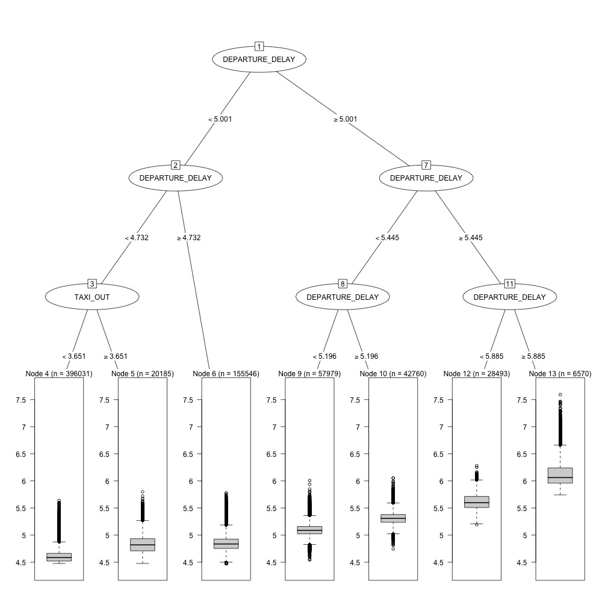
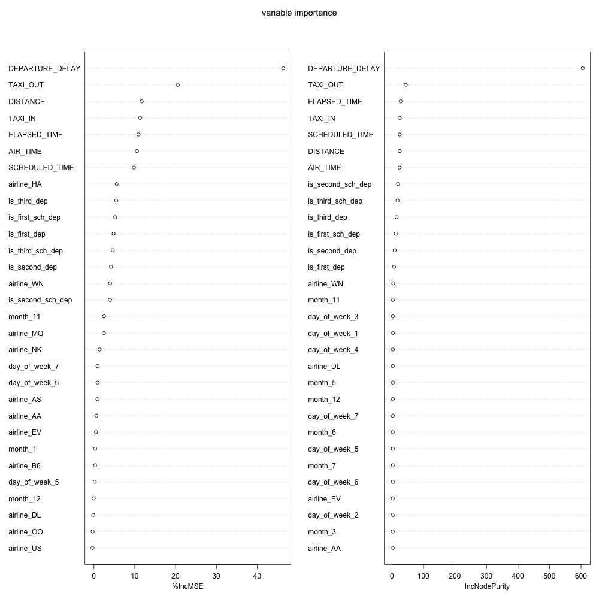

## Analysis of the flight delay data

### Pre-treat data
We library relevant packages, read the data and transform them into data.table form firstly.
```{r dealdata, message=FALSE}
library(MASS)
library(rpart)
library(randomForest)
library(pROC)
library(data.table)

flight <- read.csv("flights.csv",colClasses=c("YEAR" = "character", "DEPARTURE_TIME" = "character",
                                              "MONTH" = "character", "WHEELS_OFF" = "character",
                                              "DAY" = "character", "ORIGIN_AIRPORT" = "character",
                                              "SCHEDULED_DEPARTURE" = "character", "WHEELS_ON" = "character",
                                              "SCHEDULED_ARRIVAL" = "character", "ARRIVAL_TIME" = "character"))
flight <- as.data.table(flight)

flights2 <- flight
rm(flight)
```

Unlike before, we select all analyzable columns without preferences and 16 columns are selected.
```{r dealdata2, warning=FALSE}
#Select col
select_col <- c("MONTH", "DAY", "DAY_OF_WEEK", 
                "AIRLINE", "ORIGIN_AIRPORT", "DESTINATION_AIRPORT", "SCHEDULED_DEPARTURE", 
                "DEPARTURE_TIME", "DEPARTURE_DELAY", "TAXI_OUT", "SCHEDULED_TIME", 
                "ELAPSED_TIME", "AIR_TIME", "DISTANCE", "TAXI_IN", "ARRIVAL_DELAY")
flights2 <- flights2[, select_col, with=F]

# nan
flights2 <- na.omit(flights2, invert = F)

flights2 <- flights2[is.na(as.numeric(flights2$ORIGIN_AIRPORT)),] #numeric airport id. should be deleted.

```

We want to convert arilines, airports, months, days of month, days of week and etcs into dummy variables. However, there are nearly 300 airports and if we take them into consideration, the memory is full, so we delete it. (However, we can try to classify the airport to solve this problem.)

The departure time influence the delay largely, whereas the departure time doesn't have meanings itself. Therefore, we split the departure time into three classes: 0~8, 8~16, 16~24.

```{r dummyvariable}
# dummy variable
library(nnet)
month_mat <- class.ind(flights2$MONTH)
colnames(month_mat) <- paste("month_", colnames(month_mat), sep = '')

day_mat <- class.ind(flights2$DAY)
colnames(day_mat) <- paste("day_", colnames(day_mat), sep = '')

day_of_week_mat <- class.ind(flights2$DAY_OF_WEEK)
colnames(day_of_week_mat) <- paste("day_of_week_", colnames(day_of_week_mat), sep = '')

airline_mat <- class.ind(flights2$AIRLINE)
colnames(airline_mat) <- paste("airline_", colnames(airline_mat), sep = '')

## SCHEDULED_DEPARTURE
flights2$SCHEDULED_DEPARTURE <- as.numeric(flights2$SCHEDULED_DEPARTURE)
flights2$is_first_sch_dep <- 0
flights2[between(SCHEDULED_DEPARTURE, 0, 799), is_first_sch_dep := 1 ]

flights2$is_second_sch_dep <- 0
flights2[between(SCHEDULED_DEPARTURE, 800, 1599), is_second_sch_dep := 1]

flights2$is_third_sch_dep <- 0
flights2[between(SCHEDULED_DEPARTURE, 1600, 2359), is_third_sch_dep := 1]

## DEPARTURE_TIME
flights2$DEPARTURE_TIME <- as.numeric(flights2$DEPARTURE_TIME)
flights2$is_first_dep <- 0
flights2[between(DEPARTURE_TIME, 0, 799), is_first_dep := 1]

flights2$is_second_dep <- 0
flights2[between(DEPARTURE_TIME, 800, 1599), is_second_dep := 1]

flights2$is_third_dep <- 0
flights2[between(DEPARTURE_TIME, 1600, 2359), is_third_dep := 1]


flights2 <- cbind(flights2, month_mat, day_mat, day_of_week_mat,
                  airline_mat)
```

Finally, the tail of delay time is heavy, we use logarithm transformation to reduce the heavy tail. Since the part most interested in is the delay part, we only use the data that departure delay and arrival delay is large than zero. To retain the information as more as possible, we substruct the minimal of delay time and take the logarithm transformation.

```{r step1_step2}
flights0930_2 <- flights2[,-c(1:8,34:64)]
rm(flights2, day_mat, month_mat, day_of_week_mat, airline_mat)
min_departure <- min(flights0930_2$DEPARTURE_DELAY)
min_arrival <- min(flights0930_2$ARRIVAL_DELAY)
flights0930_2 <- flights0930_2[flights0930_2$DEPARTURE_DELAY>0 & flights0930_2$ARRIVAL_DELAY>0, ]
```

```{r arrival}
qqnorm(flights0930_2$ARRIVAL_DELAY)
qqnorm(log(flights0930_2$ARRIVAL_DELAY-min_arrival))
```

```{r departure}
qqnorm(flights0930_2$DEPARTURE_DELAY)
qqnorm(log(flights0930_2$DEPARTURE_DELAY-min_departure))
```

From the Q-Q plot, after taking logrithm, the tail is not such heavy and the data is more suitable for our analysis. Therefore, we transform the data.

```{r log}
# step1, step2
flights0930_2$DEPARTURE_DELAY=log(flights0930_2$DEPARTURE_DELAY-min_departure)
flights0930_2[, 2:7] = log(flights0930_2[, 2:7])
flights0930_2$ARRIVAL_DELAY=log(flights0930_2$ARRIVAL_DELAY-min_arrival)
```


After that, we extract the training set and the testing set.
```{r extracttraintest}
train = sample(c(T,F),nrow(flights0930_2),rep=T)
test = !train

```

### Linear Model and Variable Selection
In this part, we use simple linear regression to predict flight delay as response and then use backward and forward selection to identify the most relevant predictors.
```{r linearregression}
# step3
fit1 <- lm(ARRIVAL_DELAY~.,data = flights0930_2[train,])
summary(fit1)
```

The $t$ values of linear regression show these variables are correlated with the delay with high significance. To identify the most relevant predictors, we chose $AIC$ as our criterion and set direction as both. Since we are not going to find a best simple linear regression model but to observe the order of the importance of each predictor, we don't set the end condition.
```{r linearregressionAIC}
fit_step <- stepAIC(fit1,direction="both",trace = FALSE)
summary(fit_step)
```

The order of the importance with respect to this method is revealed in the above sheet. We can find the DEPARTURE_DELAY, SCHEDULED_TIME, ELAPSED_TIME, TAXI_OUT, AIR_TIME, TAXI_IN are the most influential variables.

### Tree Model and Variable Selection
Also, we use tree model to do the same thing. Regression tree model training is fast, the tree diagram is as follows.

```{r tree}
# step4
## 回归树
fit_tree <- rpart(ARRIVAL_DELAY~.,data = flights0930_2[train,])
# rpartTrue2=as.party(fit_tree)
```



It can be seen that in the regression tree model, the most effective variable for the partitioning interval is the DEPARTURE_DELAY, followed by TAXI_OUT, and the arrival delay is also increasing as the DEPARTURE_DELAY is increased. One third of the samples are in Node 4.

### Random Forest Model and Variable Selection
Similarly, we use random forest model to conduct regression and identify the importance of variables. %IncMSE measures the MSE increasing, which is achieved by assigning a random value to each variable. If this variable is very important, the prediction error will increase, so the increase of error is equal to the decrease of accuracy. Therefore, the larger this value is, the more important this variable is.

IncNodePurity is another index. If the regression is performed, node purity is actually the reduction of RSS (residual sum of squares), and the increase in node purity is equivalent to the reduction of Gini index, that is, the data or classes in the node are the same, which is also Mean Decrease Gini.

```{r randomforest}
## 随机森林
fit_forest <- randomForest(ARRIVAL_DELAY~., data = flights0930_2[sample(1:nrow(flights0930_2), 10000, replace = FALSE),],ntree=100,mtry=5,importance=TRUE, proximity=TRUE)
print(fit_forest$importance)

```


```{r step4plot}
#用画图来看变量的重要性
# varImpPlot(fit_forest, main = "variable importance")
```

According to the results of %IncMSE and IncNodePurity, DEPARTURE_DELAY was the most important factor affecting delay time, followed by TAXI_OUT. Of course, Distance and Elapsed_time are also important factors that affect the delay time.

### Test
Now we use mean square error as the criterion to judge models.

```{r step5}
# step5验证
pred1=predict(fit_step,newdata=flights0930_2[test,])
pred2=predict(fit_tree,newdata=flights0930_2[test,])
pred3=predict(fit_forest,newdata=flights0930_2[test,])
result=cbind(pred1,pred2,pred3)
#以均方误差作为评估标准
dif=result-flights0930_2$ARRIVAL_DELAY[test]
mse=apply(dif^2,2,mean)
print(mse)
##逐步回归的结果明显优于两种树方法，可能是因为树方法做得太粗糙
```

With mean square error, the evaluation standard, we divide the data into training set and testing set to verify the regression results of stepwise regression model, regression tree model and random forest model, and find that stepwise regression model performs significantly better than the other two tree methods, which may be because the tree method was too rough.

### Logistic Regression
Actually, in real life, we concern more about whether the flight would delay rather than the exact delay time. Therefore, we select 1 hour as the threshold: If the arrival delay is less than it, we assume the flight is delayed; otherwise, it doesn't.
```{r step6, warning=FALSE}
# step6
flights0930_2l=flights0930_2[sample(1:nrow(flights0930_2), 10000, replace = FALSE)]
flights0930_2l$ARRIVAL_DELAY[flights0930_2l$ARRIVAL_DELAY<=log(60 - min_arrival)] <- 0
flights0930_2l$ARRIVAL_DELAY[flights0930_2l$ARRIVAL_DELAY>log(60 - min_arrival)] <- 1
```

After that, we are able to conduct the logistics regression.
```{r step7, warning=FALSE}
# step7
fit_full <- glm(ARRIVAL_DELAY~.,family=binomial(link="logit"),data = flights0930_2l)
summary(fit_full)
fit_step2 <- stepAIC(fit_full,direction="both",trace = FALSE)
summary(fit_step2)
```

According to the results, we can see that, almost the same as the results of the random forest, the major factors affecting the delay time are: DEPARTURE_DELAY, SCHEDULED_TIME and ELAPSED_TIME.

### Summary
In the first operation, we chose DEPARTURE_DELAY, Distance, number of flights and SCHEDULED_TIME as the main factors affecting arrival delay. 

We consider all of the variables this time, using the method of backward and forward, regression tree and random forest to pick out the important variables to return, part of the result is similar to the first homework. DEPARTURE_DELAY, SCHEDULED_TIME, ELAPSED_TIME, TAXI_OUT, AIR_TIME, TAXI_IN, Distance are selected out. 

We have taken into account the factor of departure delay, because both subjectively and objectively, the variable of departure delay is the main factor affecting the arrival delay time. However, TAXI_IN and TAXI_OUT are the foremost two we deleted in our first homework, which suprises us this time. It turns out that intuition has drawbacks, whereas the simple model won't extract abstract information directly such as number of flights. We have to utilize both human intelligence and computer power to strengthen our inference.

